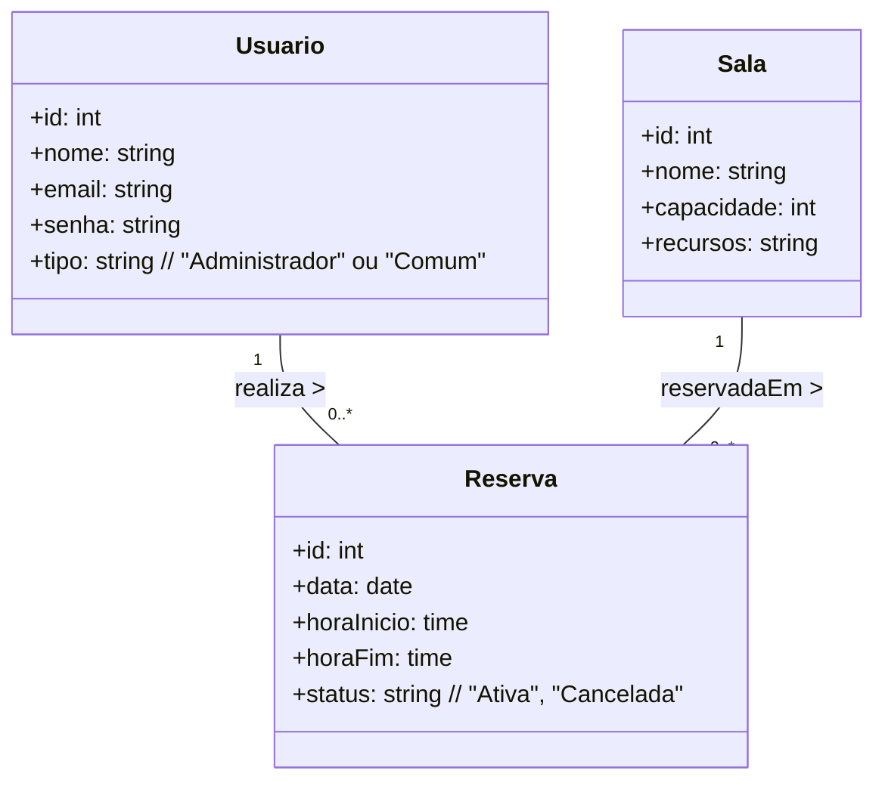
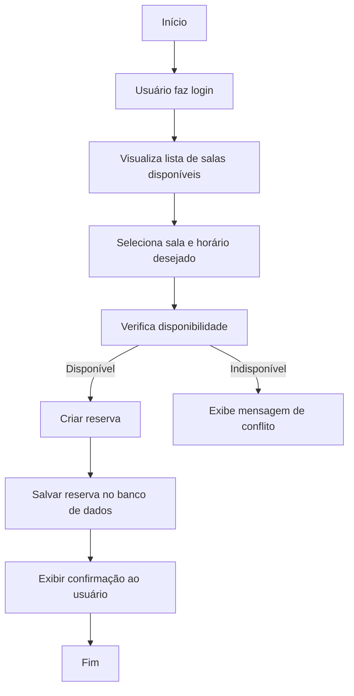

# Sistema de Reserva de Salas de Reunião (Connect Coworking)

## Briefing

### Visão Geral do Projeto
O projeto consiste no desenvolvimento de uma plataforma web para o **Connect Coworking**, cujo objetivo é otimizar o processo de agendamento de salas de reunião.  
Atualmente, as reservas são feitas manualmente por e-mail, o que gera conflitos de horário e ociosidade das salas.  

A nova aplicação permitirá o **cadastro e gerenciamento de salas**, além do **agendamento automatizado de reservas**, garantindo maior controle, transparência e eficiência no uso dos espaços.  
A plataforma será desenvolvida como uma **SPA (Single Page Application)** com **autenticação e autorização por perfil de usuário**, integrando uma **interface moderna e responsiva**.


## Escopo

### Objetivos

- **Centralizar as Reservas:** Reunir todas as informações sobre as salas e reservas em um único sistema.  
- **Evitar Conflitos de Horário:** Implementar regras que impeçam a criação de reservas sobrepostas.  
- **Melhorar a Experiência do Usuário:** Permitir que qualquer usuário veja a disponibilidade em tempo real e realize reservas de forma simples e rápida.  
- **Gerenciar Recursos do Espaço:** Oferecer ao administrador ferramentas para cadastrar salas e seus recursos (como capacidade, projetor, ar-condicionado, etc.).  
- **Garantir Controle e Segurança:** Permitir acesso conforme o perfil (Administrador ou Usuário Comum) com autenticação e autorização.


## Público-Alvo

- **Administrador:** Responsável pela gestão completa do sistema. Pode cadastrar, editar e remover salas, além de visualizar e cancelar qualquer reserva.  
- **Usuário Comum:** Funcionários ou membros do coworking que podem visualizar as salas disponíveis e realizar reservas dentro dos horários livres.


## Funcionalidades Principais

### Para Visitantes (Não Autenticados)
- Visualizar a página inicial com informações gerais sobre o Connect Coworking.  
- Acessar a página de login ou cadastro.  

### Para Usuários Comuns (Autenticados)
- Visualizar a lista de salas de reunião disponíveis com informações como nome, capacidade e recursos.  
- Filtrar salas por capacidade, recursos ou horário.  
- Criar uma reserva, selecionando sala, data, hora de início e hora de fim.  
- Visualizar as próprias reservas realizadas.  
- Cancelar uma reserva antes do horário de início.  
- Editar o próprio perfil (nome, e-mail, senha).  

### Para Administradores (Autenticados)
- Todas as funcionalidades dos usuários comuns.  
- **Gerenciar Salas (CRUD):**
  - Criar novas salas informando nome, capacidade e recursos disponíveis.  
  - Editar e remover salas existentes.  
- **Gerenciar Reservas:**
  - Visualizar todas as reservas do sistema.  
  - Cancelar reservas de qualquer usuário, se necessário.  
- **Painel de Controle:**
  - Visualização diária das reservas por sala, com horários e status.


## Requisitos Essenciais (MVP)

### CRUD de Salas
- Campos: nome, capacidade, recursos disponíveis.  
- Validação para evitar nomes duplicados.  

### Sistema de Reservas
- Associação entre sala, usuário e intervalo de tempo (data, hora de início, hora de fim).  
- Bloqueio automático de reservas em horários já ocupados.  
- Cancelamento e listagem de reservas.  

### Visualização das Reservas do Dia
- Lista ou grade mostrando todas as reservas organizadas por sala e horário.  

### Autenticação e Autorização
- Login e cadastro de usuários.  
- Perfis distintos para **Administrador** e **Usuário Comum**.  


## Benefícios Esperados
- Eliminação de conflitos de agendamento.  
- Redução de tempo gasto em comunicações manuais (e-mails, mensagens).  
- Aumento na taxa de utilização das salas.  
- Maior controle administrativo e histórico de uso dos espaços.  
- Experiência moderna e intuitiva para todos os usuários.  


## Diagramação

### Diagrama de Classes



### Diagrama de Casos de Uso

```mermaid

usecaseDiagram
    actor "Usuário Comum" as Usuario
    actor "Administrador" as Admin

    Usuario --> (Visualizar Salas)
    Usuario --> (Filtrar por Capacidade ou Recursos)
    Usuario --> (Criar Reserva)
    Usuario --> (Visualizar Minhas Reservas)
    Usuario --> (Cancelar Reserva)
    Usuario --> (Editar Perfil)

    Admin --> (Cadastrar Sala)
    Admin --> (Editar Sala)
    Admin --> (Remover Sala)
    Admin --> (Visualizar Todas as Reservas)
    Admin --> (Cancelar Reserva de Usuário)
    Admin --> (Gerenciar Usuários)


```

### Diagrama de Fluxo

